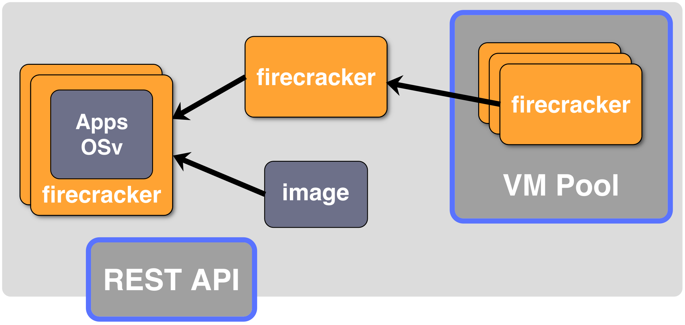
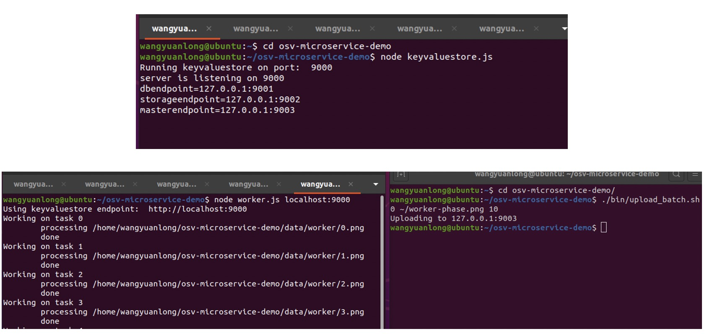
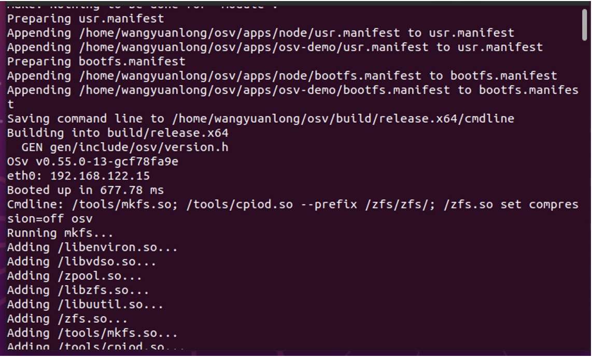

[TOC]

## 项目介绍

​          随着云计算的兴起，越来越多的人们使用云平台来运行自己的服务与应用。为了提高资源的有效利用，云提供商常常会使用虚拟化技术将同一台物理机划分给不同的云租户。Unikernel是继Docker之后的又一种虚拟化技术，Unikernel 是将应用代码及其依赖与 libOS 一同打包的单一功能的单地址空间镜像，它具有轻量，快速，结构简单，安全，不可变基础设施等等特性，这些特性也使得 unikernel 非常适合于微服务（microservice）以及物联网（IoT）等等的架构。

​          我们参考研究了工业控制系统的结构。其大体的工作流程是在interface部分利用传感器等采集信号，然后通过Information Processing部分进行信息的处理，最后在intelligence部分对系统进行智能控制。我们的项目选取了其中的信息处理部分的一小部分，将应用进行解耦与模块化。将相对独立的功能封装进 Unikernel 运行，来发挥 Unikernel 快速，安全，轻量的优点，满足相应需求。 


## 立项依据

### 重要性与前瞻性


随着对云端访问的需求量的增大，如何进一步提高服务性能成了重要的课题。我们的项目便是利用Unikernel的特性， 在Unikernel的基础上，我们针对实际应用中出现的情景，运用模块化的思想，在更高的层次上对实际的需求进行抽象，将其切分为更小的基本组件，将原有的应用解耦后打包进Unikernel,  以实现对计算资源更充分的利用，提高服务集群的性能，主要优势在：

- 与容器方案相比：更好的安全性和隔离性。
- 与传统VM的方案相比：更好的容错性。这是因为一个Unikernel实例相当于一个虚拟服务器，它的崩溃不会影响整个任务的执行，调度系统只需要再创建/调度另一个提供同样服务的Unikernel即可。

#### 负载均衡

如果我们有多个可以提供服务的资源时，这一资源有可能是一个CPU核，或是服务器集群中的一台服务器等等，负载均衡技术就可以帮助我们提高效率。考虑我们有多个CPU核与多个进程的情形，如果所有进程都在一个核上等待运行，那么会产生很多的等待时间，同时其它的核又处于空闲，既降低了服务效率，又造成资源浪费。这时完全可以将一些排队中的进程调度到其它空闲核上，从而利用起多核的资源。

#### 资源缓冲池

资源池化是优化资源利用的常用策略，其本质是一种重新组织资源的方式。比如对于线程，其创建和销毁的过程是慢于其唤醒和挂起的过程的，但同时线程这一资源又要在系统中频繁的被使用和弃置，为了降低创建销毁开销，可以使用线程池方法，即预先启动一系列空闲线程，当需要创建线程时，从线程池中唤醒一个线程处理请求，当处理完成时将线程重新挂起，放回线程池中。


## 项目架构

### 总体设计（微服务部分）

DEMO整体由以下几个部分组成：

- master，负责在各个服务模块之前转发信息，这样在服务模块需要调用其他模块完成工作的时候，不需要直接知道这些模块的状态以及他们的具体接口，只需要将调用请求发送给master，然后由master作为中介，决定具体调用的模块，最后将结果返回给请求发送者。
- key-value store，相当于一个服务注册器，每个服务模块启动的时候都会在这里注册。注册信息包括服务模块的类型和地址。每次通过master调用具体的服务模块时，master都会从key-value store中获取目标服务模块的地址，然后向该地址发送信息。
- 任务调度器(db)，主要作用是维护了一个任务队列，每一个任务对象包含的信息有：全局唯一的任务ID，任务的类型，任务的状态。
- storage，存储模块，用来存储待处理的数据(raw data)。例如，如果是一个图片处理任务，那么其中存储的就是待处理的图片。
- worker，真正直接执行具体任务的模块。有了如前所述的架构支撑，这个部分可以根据实际应用场景的需求来填充worker部件。这个部分也是全局运算资源需求最大的部分。

[这里放个图] //有要补充的模块请联系我或自行补充

### Uigniter 

用于管理Firecracker集群，大致分为以下几个部分

- VM Pool

  核心模块，维持着一个Firecracker VM的池子，其中的VM都已经分配了网络资源并进行了预配置，当新的OSv实例需求来临时，只需抽出一个可用的VM并配置剩余信息（镜像、启动参数），我们希望通过这种方式减少冷启动延迟。

  使用两个go channel分别存储预配置和待销毁的Firecracker，并由一个go routine专门负责Firecracker创建（及资源分配）和销毁（及资源回收），从而对外（主要是API Server）提供一个线程安全的接口（用于启动和停止VM）。

- Network

  创建/管理网络资源（Tap设备、IP地址、MAC地址），并分配给VM Pool预配置的Firecracker。

  使用桥接模式组织网络：Firecracker以Tap设备作为虚拟网卡，我们将所有的Tap同一个默认Bridge设备（uigniter0）连接起来，此时Bridge的功能类似真实交换机，且不同OSv实例间通信时数据包不需要经过Host机器的协议栈。

- API Server

  提供REST API的使用接口，目前实现了两种方法：

  - 创建并启动OSv实例：POST http://localhost/vm/run
  - 停止OSv实例：POST http://localhost/vm/{id}/stop



详细使用方法见[README](https://github.com/richardlee159/uigniter/blob/e1c063341d658ec897a029b30874bc01bb852a1a/README.md)


## 过程回顾

### Unikernel的选择

在前期调研中，我们先整体上了解了各种Unikernel的基本信息。不同的Unikernel实现各有其支持的应用层语言，运行平台以及擅长领域。

为了降低学习的任务量，我们倾向于选择支持C，C++的Unikernel，在调研了几种Unikernel的成熟度之后，我们最初选择了IncludeOS。但是随着对includeOS的深度学习，我们发现了includeOS应用在我们项目的几个弊端：

- 官方文档比较旧，里面有很多问题需要更新，这不利于我们的部署
- 开发上有很多限制（不能随心所欲地调用标准库）

因此我们又把目光转向了OSv，它主要有如下特点：

- 多种运行环境支持：可不加修改运行大部分单进程的POSIX程序

- 专为虚拟化环境设计：比如去除了自旋锁（spinlock）从而减少虚拟机的CPU开销；且只实现了简单的I/O驱动（VirtIO）

由于OSv移植方便，且支持多种编程语言，我们觉得它更可能促进Web应用部署由Container转向Unikernel（而不是IncludeOS、mirageOS这类移植很不方便的工具），毕竟计算机历史上很多变革靠的都不是表现“最优”的新技术，而是那些与旧技术兼容性更好、迁移更容易而表现不差的新技术。

#### OSv镜像的打包

我们使用官方提供的`./scripts/build`脚本来打包镜像，使用`image=<app_name>`参数来指定要打包的应用项目，这一脚本将会从`./apps/<app_name>`的目录寻找打包镜像所需要的文件，以上面的 native-example 为例，这一目录下有以下文件：

- hello.c ：源程序代码

- Makefile ：打包时会进行 make ，可以把依赖项获取，源代码编译等等内容全都写在里面

- module.py ：打包时指定镜像中运行的命令行等等，格式为：

  ```python
  from osv.modules import api
  
  default = api.run("/hello")	#具体使用时可以根据需要修改命令行，但是命令行也可以在运行时由参数指定，故这个地方不是必要的
  ```

- usr.manifest ：描述需要放到镜像内的文件在镜像中的位置，其中条目的格式为<镜像中位置>: <主机中位置>  这一文件通常也可以用 Makefile 来生成

- README.md ：不言自明，是简单的项目描述

#### 打包我们的模块

OSv的优点之一就是提供了很高的兼容性支持，如C，C++，node.js，java，lua，python 等等语言全部都提供运行时支持（实际上是支持 Linux API）。并且在`osv/apps/`目录下有大量的实例应用以及运行时的打包模板（即之前叙述的打包所需的一些文件，除了应用源代码）等等

我们的模块使用 JavaScript 编写，OSv 提供的打包既可以通过打包时自动下载 node ，也可以选择从主机复制node 相关文件，我们选择了自动下载，自动下载是在`./apps/node/Makefile`文件中进行设定配置以及版本选择的，首先可以使用（当前目录为OSv项目目录）

```shell
./scripts/build image=node
```

来下载，编译 node 以及生成 usr.manifest 等等，但是由于官方提供的文件似乎有些问题，直接使用脚本打包会报错，于是我们手动在自动下载的node目录中运行`make`，完成后将`./apps/node/node-8.11.2/out/Release/lib.target/libnode.so`复制到`./apps/node`目录下并改名为 `libnode-8.11.2.so`

然后再按上述方法打包即可

由于我们的模块使用了 express 框架，而 OSv 恰巧提供了`node-express-example`示例应用，所以我们将之稍加改动，用以打包我们的应用，通过之前的介绍，只需要将该示例中打包进镜像的 js 源代码改动一下，并且将我们的模块中`require`调用的路径参数修改一下即可。

按照之前的描述，将 Firecracker 启动镜像所需的文件准备好，然后运行镜像如下（以keyvaluestore服务为例）：

```shell
#下面是启动实例
$ ./firecracker.py microservice.raw 2 -e "/libnode.so keyvaluestore.js"
The bridge fc_br0 does not exist per brctl -> need to create one!
[sudo] password for wangyuanlong: 
OSv v0.55.0-13-gcf78fa9e
eth0: 172.16.0.2
Booted up in 907.72 ms
Cmdline: /libnode.so keyvaluestore.js  
Running keyvaluestore on port:  9000
server is listening on 9000
```

这里的 firecracker.py 文件为根据我们需要修改的启动脚本，可以支持多个 unikernel 使用网络通信，其 ip 地址通过命令中的参数进行配置

### OSv的修改 

我们发现，当OSv中的应用空闲/阻塞时（比如Nginx等待请求），整个OSv实例仍会占用宿主机超过10%的CPU资源，这是不合理的。而且考虑到这意味这我们的测试机只能同时运行不到100个Unikernel，这是完全无法接受的。

经调研分析我们认为主要原因在于OSv代码中的两处问题：

1. 每次CPU准备进入空闲状态之前，都会循环一定次数（10000）寻找其它工作
2. 无论应用是否处于阻塞状态，page-access-scanner线程都会在每秒运行一定次数（1000）

通过大胆地减小这两个参数，我们实现了空闲时接近于0%的CPU占用率。在之后的测试中，我们暂时没有发现这次修改带来的负面影响

### Hypervisor的选择 

我们首先尝试了Linux/KVM环境下常用的Hypervisor，如QEMU、Xen。但是，这类应用的目的是运行各种各样的虚拟机，他们实现了很多复杂I/O设备，运行时开销较大，更谈不上利用Unikernel单地址空间等特性。在测试机上，使用QEMU启动最简单的OSv镜像（打印字符串后暂停，只读文件系统）需要120ms，运行时内存占用75M。

[Solo5](https://github.com/Solo5/solo5)是一个专为Unikernel打造的Hypervisor，性能表现非常好，可惜目前只有MirageOS能比较方便地使用。

[Firecracker](https://github.com/firecracker-microvm/firecracker)是一个由AWS开发的轻量级Hypervisor，旨在加速他们的Serverless服务，如AWS Lambda。由于设计时就明确了其特定的应用场景，Firecracker仅实现了五种必要的I/O设备：virtio-net、virtio-block、virtio-vsock、串口、键盘，而且它的的启动过程也更为简单，省去了实模式加载等步骤，这些原因都使Firecracker较QEMU有很大的性能提升。同样是前面提到的镜像，使用Firecracker启动只需要5ms，内存占用15M。

尽管Firecracker也没有利用Unikernel独有的特性，但对我们的项目来说已经足够优秀，因此我们决定选择它作为OSv的Hypervisor。

下图展示了Firecracker的结构。一个Firecracker进程支持运行一个VM（对我们来说就是OSv实例），且提供一个基于UDS的API用于控制VM状态。在Uigniter中，我们利用了这个特性，先行创建一个Firecracker进程池，通过API配置好虚拟网卡、MAC地址等基础信息，当启动新VM的请求来临时配置镜像文件、启动参数等剩余信息并启动，希望通过这种方式减少操作的延迟。


### Uigniter的提出

理想情况下，我们希望有类似Kubernetes这样的工具来编排OSv实例。现有条件下,我们可以使用K8s+Virtlet插件或者OpenStack，通过移植Firecracker替代原本的Libvirt/QEMU后端，达到运行OSv的目的；又或者通过专为Firecracker开发的管理工具[Weave Ignite](https://github.com/weaveworks/ignite/)（类似容器中的Docker，运行OCI标准的镜像），修改使其兼容OSv镜像。不过，上述工具都是原本为虚拟机/容器开发的，不容易保留原本OSv+Firecracker方案的优势（如冷启动时间），对原本就比较复杂的项目加以修改对我们也是个挑战。考虑到我们的功能需求比较简单（创建、启动、停止OSv实例），我们决定使用Go语言自己实现一个轻量的OSv管理工具，这就是Uigniter。

### 将 keyvaluestore.js 替换为 memcached

由于我们的项目采用模块化的设计，所以某一模块对于其它模块而言近乎黑箱，可以方便的粘合不同的功能实现以及不同语言实现。为了展示这一特点，同时也作为提高访问性能的尝试，我们将 keyvaluestore.js 替换为 memcached 应用。

memcached是一套开源的分布式高性能对象缓存应用，由 LiveJournal 的 Brad Fitzpatrick 开发，但被许多网站使用，以 BSD license 授权发布。其初衷是进行数据库访问在内存中的缓存，以对数据库访问进行加速，出于这个目的它没有认证以及安全管制，也不提供冗余以及数据恢复，但在性能上很有优势，同时可以方便的进行水平扩展。另外其存储也是简单的键值存储方式，与 keyvaluestore.js 在功能上是一致的。

memcached的服务端和用户端之间可以通过简单的基于文本行的协议通信，也就是说通过`telnet`也可以在memcached上保存数据、取得数据。memcached 也提供了与其连接的 API，可以在客户端通过调用 API 与之通信，当然由于其通信接口的变化，需要我们对其他模块稍加改动以支持与 memcached 进行通信，在 js 中如下：

```javascript
var Memcached = require('memcached');
var memcached = new Memcached(kvEndpoint);
memcached.set(<key>, <value>, <expiration time>, function (err) {
		if(err){
			console.log("Key-value store is not available");
			console.log(err);
			setTimeout(registerService, 1000, service, address);
		}
	});
//expiration time指示条目的过期时间，以秒为单位，0表示永不过期
```

打包进unikernel，运行：

```shell
./scripts/firecracker.py -n -e"./memcached -u root -t1 -p 9000 -m5000"
OSv v0.55.0-13-gcf78fa9e
eth0: 172.16.0.2
Booted up in 219.53 ms
Cmdline: ./memcached -u root -t1 -p 9000 -m5000  
Memcached for OSV, based on Memcached 1.4.21
```

在另一终端中：

```shell
$ telnet 172.16.0.2 9000
Trying 172.16.0.2...
Connected to 172.16.0.2.
Escape character is '^]'.
set key1 0 0 3	#set请求，设置键值，最后一个参数为值域的字节数，前面两个数字在这里用不到，设0即可
111				#输入数据
STORED			#成功提示
get key1		#get请求
VALUE key1 0 3	#返回键信息
111				#返回值域
END				#信息结束
```

将此 unikernel 替换进去并对其它模块做适当修改，所得运行结果完全不变。


## 结果展示

### 运行结果

#### 直接在Host机器运行

如果让所有模块全部在主机中运行，则它们之间的通信可以通过 localhost 进行：





#### 使用Unikernel运行

也就是Uigniter+Firecracker+OSv的方式

视频链接：https://rec.ustc.edu.cn/share/94693a20-cc17-11ea-a95e-cf8b29b975c1

### 性能测试

在实际使用中，用户感知到的（冷启动）响应时间，应该是自用户请求微服务，至得到微服务的响应的这段时间，中间经历了创建OSv实例、启动OSv、加载应用等阶段。我们在测试机上启动了100个OSv实例，应用为cURL，测得平均相应时间为163ms。如果将Uigniter的API调用途径由localhost改为Unix domain socket，应该可以进一步提升性能。


## 未来展望

我们项目理想的架构（可以把微服务的标准模型搬过来？）

项目的愿景（未来还可以做的）


### 对于Serverless的意义 

Serverless现在主要有三种实现方式：一种通过容器实现，这是目前大多数云服务提供商的选择，不过多租户下的容器安全是个需要小心处理的地方，尝试解决的方案也有许多；一种是通过虚拟机实现，以AWS Lambda为代表，其安全性不言而喻，性能问题正在尝试通过更轻量的VMM来缓解；还有一种以Cloudflare Workers为代表，通过语言运行时（V8引擎）进行不同任务的隔离与调度，宣称拥有很好的性能与安全性，不过这种方案会限制编程语言的选择。

Serverless函数运行的任务一般比较简单，大部分都能兼容OSv这样的Unikernel，加上Unikernel本身在启动时间、内存开销、安全性（待考察）方面的优势，我们认为它是完全有能力作为第四种方案的。我们项目中的Uigniter，其实也是尝试用OSv支撑Serverless函数的一种工具。我们希望在未来，通过工具链的完善，类OSv的Unikernel能够成为Serverless平台上的首选方案。


## 附录

### 项目中使用的测试机配置

- E3-1270v6
- 32GB RAM
- SSD
- Ubuntu 20.04 x64