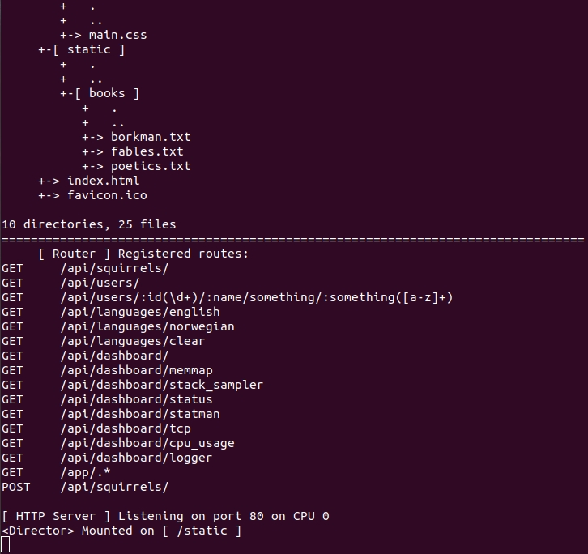

# 可行性报告

[TOC]

## 项目介绍

本项目将一般网络程序中的任务拆分为常用的服务，不同服务集成到不同的Unikernel中。通过合理地编排调度Unikernel集群，将各种并发的服务组合起来，处理任务请求，从而充分利用多核/多CPU资源，提高系统性能，同时又不破坏Unikernel原有的轻量、安全的特性。


## 理论依据

### 负载均衡技术

负载均衡是一种计算机技术，用来在多个计算机（计算机集群）、网络连接、CPU、磁盘驱动器或其他资源中分配负载，让所有节点以最小的代价、最好的状态对外提供服务，快速获取重要数据，最大化降低了单个节点过载、甚至crash的概率，解决大量并发访问服务问题。

如果我们有多个可以提供服务的资源时，这一资源有可能是一个CPU核，或是服务器集群中的一台服务器等等，负载均衡技术就可以帮助我们提高效率。考虑我们有多个CPU核与多个进程的情形，如果所有进程都在一个核上等待运行，那么会产生很多的等待时间，同时其它的核又处于空闲，既降低了服务效率，又造成资源浪费。这时完全可以将一些排队中的进程调度到其它空闲核上，从而利用起多核的资源。

常用的负载均衡策略包括：轮询，按比率分配，按优先级分配，按负担轻重分配，按响应速度分配，按最佳效率分配（相当于综合前面两项），随机分配，使用Hash方法分配等等。

### 资源缓冲池技术

资源池化是优化资源利用的常用策略，其本质是一种重新组织资源的方式。比如对于线程，其创建和销毁的过程是慢于其唤醒和挂起的过程的，但同时线程这一资源又要在系统中频繁的被使用和弃置，为了降低创建销毁开销，可以使用线程池方法，即预先启动一系列空闲线程，当需要创建线程时，从线程池中唤醒一个线程处理请求，当处理完成时将线程重新挂起，放回线程池中。

这一策略中还有一些细节问题可根据实际需要选择，比如当所有资源被占用的时候面对新请求是额外创建资源对象还是搁置请求直到有资源空闲下来再分配。前者可以一定程度避免缓冲池的溢出，提高服务可用性；但后者避免实际资源被过度的分割（比如CPU时间被大量活跃线程分割得过小）。再比如当超出的资源（资源池空时被新建的实例）被释放的时候是将其销毁还是添加到资源池中，两种选择各有利弊。

线程池模式一般分为两种：HS/HA半同步/半异步模式、L/F领导者与跟随者模式。

- 半同步/半异步模式又称为生产者消费者模式，是比较常见的实现方式，比较简单。分为同步层、队列层、异步层三层。同步层的主线程处理工作任务并存入工作队列，工作线程从工作队列取出任务进行处理，如果工作队列为空，则取不到任务的工作线程进入挂起状态。由于线程间有数据通信，因此不适于大数据量交换的场合。
- 领导者跟随者模式，在线程池中的线程可处在3种状态之一：领导者leader、追随者follower或工作者processor。任何时刻线程池只有一个领导者线程。事件到达时，领导者线程负责消息分离，并从处于追随者线程中选出一个来当继任领导者，然后将自身设置为工作者状态去处置该事件。处理完毕后工作者线程将自身的状态置为追随者。这一模式实现复杂，但避免了线程间交换任务数据，提高了CPU cache相似性。在ACE(Adaptive Communication Environment)中，提供了领导者跟随者模式实现。

### Nginx调度与通信

#### Nginx进程模型

Nginx 默认使用一种 Master-Workers 的进程模型，Nginx 被启动时将会启动一个 Master 进程，读取配置并设置监听套接字，然后 fork() 出多个 Worker 进程。 Master 进程负责管理 Worker 进程以实现重启，升级，更新日志，更新配置等功能，worker 处理基本的网络事件请求，且一个请求有且仅有一个 Worker 为其服务。

Nginx实现高并发的关键在于一个 Worker 可以响应大量请求，而不是像传统做法中针对一个请求启动一个进程（或线程）。传统做法中，由于一个轻量级的网络请求也会引起一个重量级的进程为之服务，所以并发量不高。并且通常情况下，一个 Worker 进程占据（并可以绑定）一个CPU核，减少了传统模式下多进程调度以及上下文切换带来的性能损耗，也提高了进程的独立性，这里实际上每个Worker是单线程的。

Nginx 的设计是不让工作进程阻止网络流量，除非没有任何工作要做。此外，每一个新的连接只消耗很少的资源，仅包括一个文件描述符和少量的工作进程内存。当用户发出请求的时候，产生一个连接，所有的 Worker 都会接收到通知，但只有一个进程可以 accept，这实际上是一个互斥操作，Nginx 提供了互斥锁 accept_mutex。

先打开accept_mutex选项，只有获得了accept_mutex的进程才会去添加accept事件。nginx使用一个叫ngx_accept_disabled的变量来控制是否去竞争accept_mutex锁。ngx_accept_disabled = nginx单进程的所有连接总数 / 8 -空闲连接数量，当ngx_accept_disabled大于0时，不会去尝试获取accept_mutex锁，ngx_accept_disable越大，于是让出的机会就越多，这样其它进程获取锁的机会也就越大。不去accept，每个worker进程的连接数就控制下来了，其它进程的连接池就会得到利用，这样，nginx就控制了多进程间连接的平衡。

Nginx中还有两种进程：

- 缓存加载器进程：负责将磁盘高速缓存加载到内存中。这个进程在启动时运行后随即退出。
- 缓存管理器进程：负责整理磁盘缓存的数据保证其不越界。这个进程会间歇性运行。

#### Nginx事件驱动

Nginx的高并发支持还归功于它的事件驱动机制。传统模型中一个进程处理一个请求，实现一个I/O操作，有很多时候处于阻塞状态等待I/O，而Nginx的一个 Worker 处理多个请求，使用I/O多路复用模型epoll，当有I/O请求的时候，Worker 会切换到其他请求进行处理，直到有“事件”发生，回馈给Nginx进程，这样进程对于I/O是非阻塞的。

每个工作进程需要处理若干套接字，包括监听套接字或者连接套接字。当监听套接字收到新的请求时，会打开一个新的连接套接字来处理与客户端的通信。当一个事件到达连接套接字时，工作进程迅速完成响应，并转而处理其他任何套接字新收到的事件。

有时候我们使用一些第三方模块，第三方模块可能会做大量的CPU运算，这样的计算任务会导致处理一个事件的时间过长，会导致后续队列中大量事件长时间得不到处理，从而引发恶性循环，大量的CPU资源和Nginx的任务都消耗在处理连接不正常地断开，所以往往Nginx不能容忍有些第三方模块长时间的消耗大量CPU资源进行计算任务。因此应该分段使用CPU，而不是一次使用大量CPU。

### Kubernetes 调度与通信

Kubernetes（简称k8s）是一个开源容器管理编排系统，其结构如下所示：

​                        

其中 Nodes 是一组机器集群(cluster)，负责运行由一系列容器组成的 Pods 作为应用的组成部分，Pod也是最简单的 k8s 对象。Node的组成有：

- kubelet：确保Pod中运行的容器正常
- kube-proxy：主要实现service，即实现nodes的网络通信，使得可以使用网络访问Pods。
- container-runtime：负责运行容器，kubernetes支持多种平台，如Docker

control plane 运行在多台机器上，负责管理 work nodes 和 Pods。control plane 完成集群中的调度，事件的探知和处理（如建立pod），它的基本组成是：

- kube-apiserver：相当于control plane 的前端，将API暴露出来。它可以水平扩展，即运行多个实例扩展。
- etcd：持久高效的键值存储，保存 cluster data。
- kube-scheduler：为新建立的 Pod 分配其运行的 Node，其调度综合多种因素。
- kube-controller-manager：运行 controller 进程，不同 controllers 逻辑上分离但为减少复杂度被编译在一个进程里运行，包括控制 nodes，replication，endpoints，Service Account & Token
- cloud-controller-manager：与云交互的 controller 进程，控制云服务商端 node，route，service，volume

另外，k8s提供一些插件，提供 DNS，容器资源监测，集群级别的容器日志等功能。

#### Kubernetes通信

cluster 向 master 的通信就是 node 或 pods 向 apiserver 的通信，通过 apiserver 监听HTTPS端口（443）实现，master其他组件向apiserver通信也通过这一方法。

apiserver 向 cluster 通信有两种路径，一种是apiserver向所有工作机上的kubelet，一种是apiserver向任意的node，pod，service。可以通过HTTPS端口或SSH隧道（不成熟）。

Pods之间使用网络通信，可以通过一个单独的DNS Pod来提供DNS service

#### Kubernetes调度

如上文所述，Kubernetes 的调度进程是 control plane 的一部分，作用是将新创建的或其它未被分派的 Pods 分发给最适合（根据调度规则）的 Node 去运行。一次调度动作可以看作两个阶段：scheduling 和 binding，前一阶段选择Node，后一阶段分派Pod。

根据 pod 中所运行的容器对资源的需求，Nodes 会先被筛选，剩下的节点称为可行节点（feasible nodes）如果没有可行节点，pod会被挂起直到可以被调度到某个节点。而后调度器调用函数对可行节点进行打分，将pod分给最高分节点（同分随机）。分派通过一个称为 binding 的过程由调度器通知apiserver完成。

调度考虑的因素有：

- 资源需求
- 硬件/软件/策略（policy） 约束
- affinity and anti-affinity specifications

注：此为一个设置 Pods 之间”远近“关系的一个机制，affinity rules使得Pods可以被分发或打包在一个service或相关的service中，Anti-affinity rules 可以避免可能相互妨碍的Pods在同一台 Node 上运行，也可以将 service 的不同 Pods 分布在 Nodes 中以容错。这一机制通过给Nodes添加标签和在Pods中添加标签选择器实现。另外，affinity rules 分为 required 和 preferred 两种，顾名思义，调度中前者必须满足，后者尽量满足。

- 数据局部性
- 负载间的妨碍与干扰
- deadlines
- ...

作为对大型集群调度的优化，可以设置最大可行节点量，只对可行节点中的一部分进行打分，即发现一定数量的可行节点后就停止搜索可行节点。


## 技术依据

### Why IncludeOS?

为了能够获得更轻量的Unikernel，我们希望选择Clean-Slate的Unikernel项目，目前处在活跃状态的有IncludeOS和MirageOS。其中IncludeOS支持使用C++编写服务，而MirageOS使用的是OCaml函数式编程语言，同时二者的LibOS提供的函数都以较为完整，足够使用。因此在考虑到学习成本和易用性的基础上，我们选择使用IncludeOS。

### IncludeOS的使用

在这个部分我们具体运行了一个IncludeOS的WebServer项目。

运行环境：Ubuntu 18.04

安装依赖项：

```shell
sudo apt-get install python3-pip python3-dev git cmake clang-6.0 gcc nasm make qemu
pip3 install setuptools wheel conan psutil jsonschema
```

使用conan安装includeOS:

```shell
conan config install https://github.com/includeos/conan_config.git
```

从github上克隆官方的demo：

```shell
git clone https://github.com/includeos/demo-examples.git
```

然后make并运行：

```shell
cd acorn
mkdir build
cd build
conan install .. -pr clang-6.0-linux-x86_64
source activate.sh
cmake ..
cmake --build .
boot acorn --create-bridge
source deactivate.sh
```

注意这里如果直接按照官方文档上的教程`boot acorn`的话会提示：

```shell
Error: argument "bridge43" is wrong: Device does not exist
```

因此要在boot后添加--create-bridge。

运行效果（部分截图）：



### 从头创建自己的unikernel

在参考includeOS的官方文档进行创建的时候，我们注意到其文档信息已经过时了。

按照官方文档，在创建时只需要在编写service.cpp文件之后将includeOS安装目录下的seed文件夹拷贝到service.cpp所在的文件夹，最后使用`boot .`即可自动创建。

然而在includeOS的最新版本中已经移除了seed文件夹。

因此如果想从头编写自己的includeOS服务，要么使用includeOS的旧版本，要么就需要手动编写CMake_list.txt、conanfile.txt等文件。

对于同类型的服务，较简洁的方法是参考参考官方的demo仓库手动编写相关文件。当这种方法无法解决问题时，再尝试使用旧版本的includeOS。

### UniK

UniK是可以看作Unikernel世界的编译和编排工具，由GO语言编写，支持将多种语言编译成Unikernel镜像，同时可以在本地或云供应商中运行和管理已编译的镜像。它具有类似于docker的命令行界面，使构建Unikernel和就像构建容器一样方便。

UniK支持的语言与对应的Unikernel实现：

| 语言                  | Unikernel实现                                                |
| --------------------- | ------------------------------------------------------------ |
| Python, Node.js, Go   | [rumprun](https://github.com/solo-io/unik/blob/master/docs/compilers/rump.md) |
| Java, Node.js, C, C++ | [OSv](http://osv.io/)                                        |
| C++                   | [IncludeOS](https://github.com/hioa-cs/IncludeOS)            |
| OCaml                 | [MirageOS](https://mirage.io)                                |

UniK支持的平台：

- 本地：[Virtualbox](https://github.com/solo-io/unik/blob/master/docs/providers/virtualbox.md)，[vSphere](https://github.com/solo-io/unik/blob/master/docs/providers/vsphere.md)，[QEMU](https://github.com/solo-io/unik/blob/master/docs/providers/qemu.md)，[UKVM](https://github.com/solo-io/unik/blob/master/docs/providers/ukvm.md)，[Xen](https://github.com/solo-io/unik/blob/master/docs/providers/xen.md)，[OpenStack](https://github.com/solo-io/unik/blob/master/docs/providers/openstack.md)
- 云供应商：[AWS](https://github.com/solo-io/unik/blob/master/docs/providers/aws.md)，[Google Cloud](https://github.com/solo-io/unik/blob/master/docs/providers/gcloud.md)

#### Unik的使用示例

将一个HTTP服务的C++代码编译为IncludeOS镜像并运行在Virtualbox上：

1. 安装Unik

   ```shell
   git clone https://github.com/solo-io/unik.git
   cd unik
   make
   ```
   
   生成的 `unik` 可执行文件位于 `_build/unik` 下。为了方便使用，可以选择

   ```shell
   mv _build/unik /usr/local/bin/
   ```

1. 配置VirtualBox网络与UniK服务

   编辑 `$HOME/.unik/daemon-config.yaml` 文件：

   ```
providers:
    virtualbox:
    - name: my-vbox
    adapter_type: host_only
    adapter_name: 配置的网络适配器
   ```

1. 启动UniK，自动部署Virtualbox Instance Listener

   ```shell
   cd _build
   make
   unik daemon --debug
   ```

1. 编写HTTP服务程序代码（存储为 `service.cpp` ）和Makefile文件
2. 编译IncludeOS镜像并启动

   ```
   unik build --name myImage --path ./ --base includeos --language cpp --provider virtualbox
   ```
   
   生成的镜像文件位于 `$HOME/.unik/virtualbox/images/myImage/boot.vmdk`，可以用下面的命令启动

   ```
   unik run --instanceName myInstance --imageName myImage
   ```
   
   然后就可以打开浏览器访问啦

更多资料：[Unik的命令行界面文档](https://github.com/solo-io/unik/blob/master/docs/cli.md)

### 使用Python启动和管理unikernel

可以使用subprocess.run函数调用virt-install命令在QEMU中启动unikernel，使用virsh destroy销毁已创建的虚拟机。

另外，可以使用名为affinity的Python第三方库使指定进程运行在特定的CPU上。

`_get_handle_for_pid(pid, ro=True) `通过一个pid获取进程。

`get_process_affinity_mask(pid) `通过pid获取这个进程当前的affinity mask ,返回一个长整形。例如返回'2l'，说明在用编号为2的CPU。

`set_process_affinity_mask(pid, value) `通过pid绑定进程到编号为value的CPU。

### QEMU的使用与通信

我们将打包好的unikernel在QEMU中运行，这就要实现QEMU之间的通信，下面介绍一下QEMU的使用和通信。

QEMU有主要如下两种运作模式：

- 用户模式（User Mode)。QEMU能启动那些为不同中央处理器编译的Linux程序。
- 模拟模式（System Mode)，亦称为系统模式。QEMU能模拟整个计算机系统，包括中央处理器及其他周边设备，它使为跨平台编写的程序进行测试及排错工作提供方便。其亦能用来在一部主机上虚拟数个不同的虚拟计算机。

考虑到系统模式的功能更强大，以及后续对service拆分的复杂程度未知。当然这种模式意味着启动的时候加载更多的项，一定程度上造成了时间上的浪费。为了满足需求这里重点介绍QEMU系统模式的使用以及通信。

**系统模式使用方法：**

系统模式命令的格式为"$qemu-system-mipsel [options] [disk_image]”。"disk_image"

是一个原始的IDE硬盘镜像。选项如表所示。

| 选项            | 说明                                |
| --------------- | ----------------------------------- |
| -kernel bzImage | 使用“bzImage"作为内核镜像           |
| -hda/-hdb file  | 使用“file"作为IDE硬盘0/1镜像        |
| -append cmdline | 使用“cmdline"作为内核命令行         |
| -nographic      | 禁用图形输出，重定向串行I/O到控制台 |
| -initrd file    | 使用“file"作为初始化的RAM磁盘       |

下面以在ubuntu环境下的使用为例：

#### 启动QEMU创建的虚拟机

准备好环境就可以启动QEMU创建的guest虚拟机了，基础的启动参数是这样的：

```shell
qemu-system-aarch64 -cpu cortex-a57 -smp 4 -m 2048M -M virt -nographic -kernel build_arm64/arch/arm64/boot/Image \
   -append "console=ttyAMA0 root=/dev/vda init=/linuxrc rw"\
   -drive format=raw,file=../busybox_rootfs/busybox-1.31.1-rootfs_ext4.img
```

第一行的"cpu"指定了处理器的架构，"smp"指定了处理器的个数，"m"指定了内存的大小。

第二行的”kernel"指定编译生成的内核镜像的存放位置.

第三行的"append"是内核启动的附加参数。

第四行的"drive"指定之前制作生成的根文件系统的镜像位置。

#### **共享文件实现通信**

为了在host和guest之间共享文件，最容易想到的方法当然是借助传统的TCP/IP网络。但我们没必要用如此庞大的TCP/IP网络。这里，我们如果借助9P协议，可以非常快速方便地实现共享，但是这时需要virtio的支持。具体实现方法如下：

1. qemu 启动参数添加virfts

   qemu启动参数需要添加 :

   ```
   -fsdevlocal,security_model=passthrough,id=fsdev0,
   path=/tmp/share -device virtio-9ppci,id=fs0,fsdev=fsdev0,mount_tag=hostshare
   ```
   
   其中path 为 host本地的共享目录
   
   然后提示：

   ```
   virtio-9p-pci' is not a valid device model name
   ```
   
   需要重新编译 qemu, 编译时添加额外的 configure 参数 --enable-virtfs
   
2. qemu 支持virfts

   ```
   ./configure --enable-kvm --enable-virtfs --prefix=/opt/software/toolchain/qemu
   ```

   注意 qemu 支持 virtfs 需要 libcap 和 libattr 等依赖库.

   编译安装 qemu 后, 再运行, 可以了.

3. 在 guest 中挂载 host 共享的目录

   ```
   mkdir /tmp/host_files
   mount -t 9p -o trans=virtio,version=9p2000.L hostshare /tmp/host_files
   ```
   
   如果提示 :

   ```
   mount: unknown filesystem type '9p'
   ```
   
   则说明构建的 guest 内核不支持 9p-virtio.需要开启对应的内核选项, 并重新编译.

4. 需要在 kernel 中添加 9p 的支持

   ```
   CONFIG_NET_9P=y
CONFIG_9P_FS=y
CONFIG_VIRTIO_PCI=y
CONFIG_NET_9P_VIRTIO=y
CONFIG_9P_FS_POSIX_ACL=y
CONFIG_NET_9P_DEBUG=y (Optional可选)
   ```
   
   然后就可以共享文件。


## 技术路线

按照设想，我们的项目实现主要分为如下几个模块：拆分service，打包为Unikernel并且能够运行，实现多个Unikernel间的通信和对Unikernel的调度以对外呈现为完整的task，实现资源池化与负载均衡机制，最后在真实的应用情景中验证思路的可行性并作性能测试。

具体如下：

首先我们需要尝试对一些现有的网络程序进行抽象，将其分解成一些通用性较强的service模块，并且使用已有的工具（UniK等）将其打包成为可以运行的Unikernel（使用IncludeOS）并尝试运行。

然后借鉴已有的一些模型框架和容器编排应用（如Nginx，Kubernetes等）的思路，同时尝试借助UniK，实现对Unikernel的调度，管理等，实现较高的并发。在初期试图在Host OS中使用 Python 实现，后期如果条件允许将尝试直接在Hypervisor上实现。

最终使用这些模块化service组建成原本的网络服务，并且比较与分析其性能原有实现方案之间的差异。


## 参考文献

https://includeos.readthedocs.io/en/latest/Getting-started.html

https://github.com/includeos/IncludeOS/blob/master/README.md

https://github.com/cetic/unikernels/blob/master/README.md

http://people.gnome.org/~markmc/qemu-networking.html

https://littlewhitejing.github.io/2018/04/23/nginx-1/

https://www.cnblogs.com/chenjfblog/p/8715580.html

https://www.qingtingip.com/h_260490.html

https://kubernetes.io/docs/concepts/
