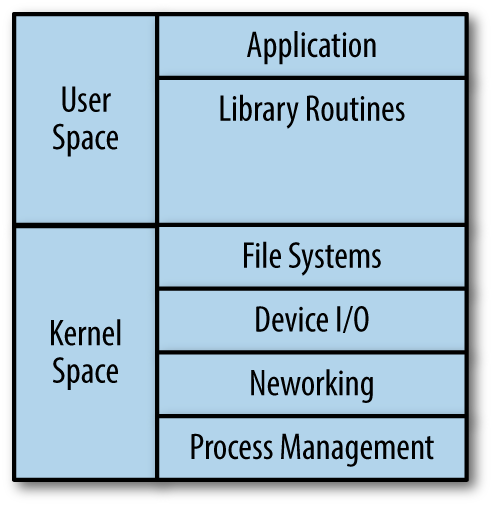
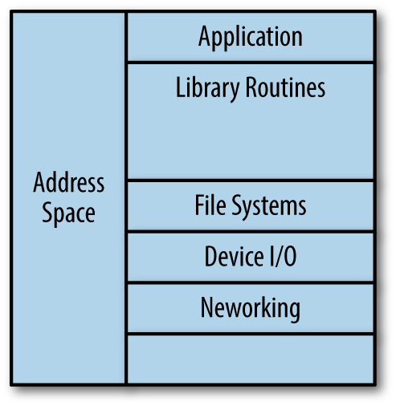
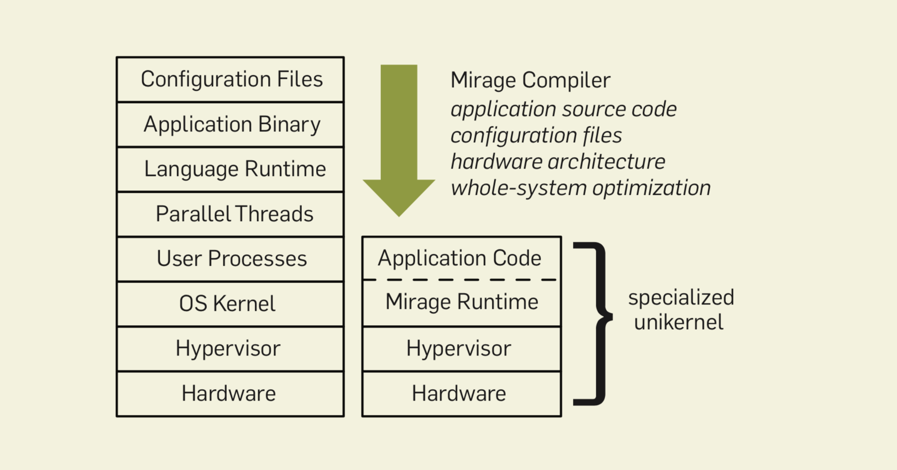
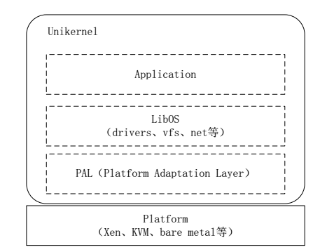
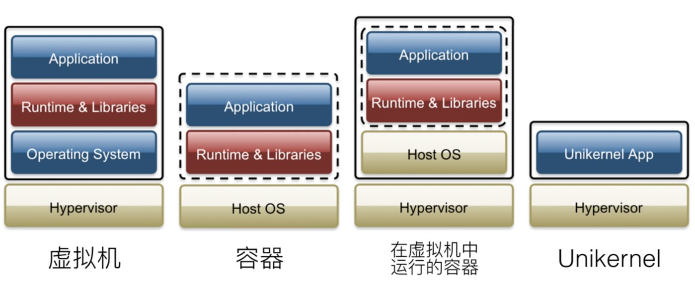
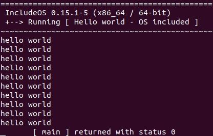
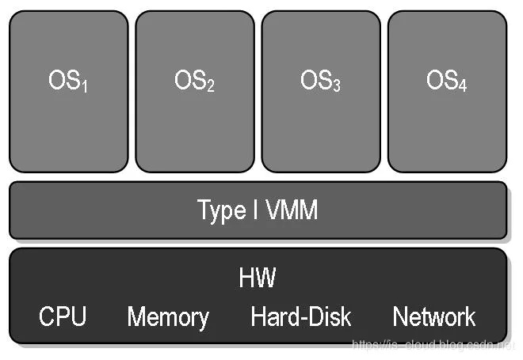
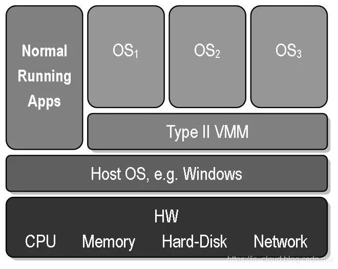
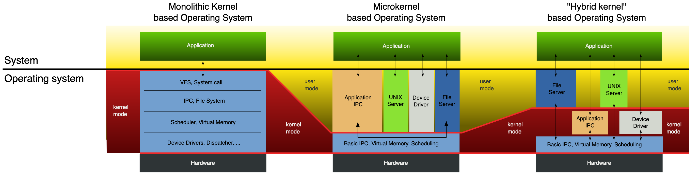

# 调研报告

[TOC]

## 小组成员

夏寒，李平赫，王原龙，张万林


## 项目简介

本项目将一般网络程序中的任务拆分为常用的服务，不同服务集成到不同的Unikernel中。通过合理地编排调度Unikernel集群，将各种并发的服务组合起来，处理任务请求，从而充分利用多核/多CPU资源，提高系统性能，同时又不破坏Unikernel原有的轻量、安全的特性。


## 项目背景

### Unikernel

#### 产生

Unikernel是在云计算的背景下诞生的。

传统的云计算系统是在一个虚拟机管理程序（Hypervisor）上运行各种虚拟机（VM），Hypervisor负责管理硬件资源（如CPU、内存、网络适配器）并提供抽象来分配给上层VM，云服务商则以VM为载体向用户提供服务。一般来说，每个VM扮演特定的角色（如Web服务器，数据库），但为了让相应的应用程序可以正常运行，VM需要拥有整个OS以及庞大的软件栈，这意味着有许多资源会浪费在不需要的服务上，同时VM的启动速度慢，攻击面也很大。以Docker为代表的容器技术提供了轻量级的虚拟化，很大程度上解决了VM系统庞大、启动慢的缺陷，其部署、分发的便捷性更使其迅速流行起来，然而安全性的问题依然保留了下来。在这样的背景下，Mirage OS的研究团队于2013年提出了Unikernel的概念。（在一定意义上，Unikernel可以说是虚拟化与操作系统结构发展的交汇点，更详细的背景介绍参见附录）

#### 原理

根据 [unikernel.org](http://unikernel.org/) 的定义：

> Unikernels are specialised, single-address-space machine images constructed by using library operating systems.

也就是说，Unikernel是专用的，单地址空间的，使用库操作系统（libOS）构建的镜像。

        

在传统模式中，OS会尽可能提供各式各样的底层服务，应用在运行时根据需要调用其中（相当小的）一部分。而Unikernel采取了另外一种思路，把传统模式中运行时做的事情放在编译时完成。通过特殊的编译工具，应用程序和它所依赖的库、驱动以及网络等功能与应用一起被打包在一个Unikernel镜像中，运行时共用一个连续地址空间。构建成的镜像可以直接在Hypervisor（如Xen）或裸金属（bare metal）上运行。当然，也有运行在Host OS上的libOS（进而构造出Unikernel），如Graphene和Drawbridge。

 

Unikernel的典型结构如下图所示。通常，Unikernel还在libOS层下面添加一层平台适配层（Platform Adaption Layer），用以根据Unikernel所运行的不同平台（Hypervisor, Bare Metal）实现对应的ABI（Application Binary Interface，应用程序二进制接口），满足目标平台兼容性要求。

 

#### 解决的问题

Unikernel试图抹去现代操作系统带来的一些复杂性。因为“通用”的操作系统（就像任何Linux和Windows的发行版）通常附带一些对某一应用来说并不需要的驱动、依赖包、服务、等等，但这些对每一个通用操作系统来说某种程度上又是必需的。精简的思想带给了Unikernel许多好处：

- 安全性的提升

  因为Unikernel里运行的内容少，减少了潜在漏洞数量，相对攻击面小。试想一个使用Unikernel部署的DNS服务器，没有Shell程序，没有各种实用工具（utilities），没有无关的驱动和库，没有密码文件。即使攻击者能在应用代码里找到漏洞，这些也极大地增加了他达到目的的难度。

- 占用空间（footprint）少

  Unikernel里只包含了程序真正依赖到的东西，无论是编译出来的镜像，还是启动后所占用的内存都非常小。一般的Unikernel镜像小于1MB，比如使用MirageOS构建的DNS服务器可以只有184KB。

- 性能好

  相比于通用操作系统，Unikernel减少了复杂的软件抽象层。Unikernel中的“内核”与应用程序没有隔离，运行在同一个地址空间中，这消除了程序在用户态与内核态之间转换以及数据复制的开销。另外，构建Unikernel时可以采用全局优化技术，优化粒度更细，可以进一步提升性能。

- 启动快

  因为包含的东西少，系统层初始化非常快，通常是几ms到十几ms，这使得各种服务可以在需要的时候快速创建。

- 不可变基础结构（Immutable infrastructure）

  在应用程序需要修改或更新时，旧的应用将被直接丢弃，并以新版本取代，而不是增添大量的修改和补丁，这样能保证应用程序的轻巧。同时，Unikernel构建的应用能快速启动这一点保证了服务器在更新时可以近似无缝衔接而不必中断服务。

##### Unikernel vs Container

与Unikernel不同的是，容器运行在宿主系统上，多个容器共享内核的资源。而Unikernel由于直接运行在Hypervisor上，具有更好的隔离性和安全性。（如前所述，Unikernel也可以直接运行在 bare metal 或 Host OS，只是不同的实现支持的平台不同，但多数选择Hypervisor）



#### 应用场景

- 云计算：启动快，可以实现按需提供服务；隔离性好
- 物联网/嵌入式设备：镜像小意味着升级方便；不可变的镜像带来更高安全性
- 高性能计算：没有上下文切换，非常高效

#### 发展现状

目前已有许多构造Unikernel的方法，它们的成熟度各不相同，大体上可分为Clean-Slate和Legacy两类。前者类似于另起炉灶，充分践行了Unikernel的设计理念；后者为了兼容性尽量保留了传统OS的接口（如POSIX），虽然使用方便，但占用的资源会比Clean-Slate类型多。目前比较活跃的项目有：

##### Clean-Slate

- MirageOS

  最早的libOS，可为跨各种云计算和移动平台的安全，高性能的网络应用程序构建unikernel。现在，在OCaml生态系统中，有100多个MirageOS库以及越来越多的兼容库。

- HaLVM

  Glasgow Haskell编译器工具套件的一个接口，使用Haskell 函数式编程语言开发，使用 Glasgow Haskell 编译器工具包；开发人员可以直接实现 Xen 上的轻量级虚拟机。

- IncludeOS

  面向云服务的小型开源 libOS，实现了在虚拟硬件上运行C++代码。

##### Legacy

- ClickOS

  基于Xen的多功能，高性能虚拟化软件中间件平台。早期的性能分析表明，ClickOS VM体积小（5MB），启动迅速（短至20毫秒），几乎没有延迟（45微秒），并且可以在使10Gb的管道饱和的情况下在低成本商用服务器上同时运行100个以上的实例。

- Nanos

  在QEMU / KVM虚拟机管理程序上运行的Unikernel 。它使用 OPS 工具实现使用任意ELF二进制文件构建Nanos Unikernel。

  OPS :https://github.com/nanovms/ops

- OSv

  专门为Cloudius Systems的云VM设计的新操作系统。OSv能够在不到一秒钟的时间内启动，在任何虚拟机管理程序之上执行单个应用程序，从而实现了卓越的性能，速度和轻松的管理。OSv可以运行未修改的Linux可执行文件（有一些限制），并且支持C，C++，JVM，Ruby和Node.js应用程序堆栈。

- Rumprun

  一个软件堆栈，可将未加修改的POSIX软件作为Unikernel运行。Rumprun支持从ARM架构硬件到虚拟机管理程序（例如Xen）的多种平台。它基于NetBSD rump kernel，该内核提供免费的，可移植的，组件化的，内核质量的驱动程序，例如文件系统，POSIX系统调用处理程序，PCI设备驱动程序，SCSI协议堆栈，virtio和TCP / IP堆栈。

  https://github.com/rumpkernel/rumprun

- Drawbridge

  用于应用程序沙箱的虚拟化新形式的研究原型。Drawbridge结合了两项核心技术：其一为picoprocess，它是基于进程的隔离容器，具有最小的内核API集；第二是一个libOS，是可以在picoprocess中高效运行的轻量版Windows。

- HermitCore

  针对高性能计算和云环境下的可伸缩和可预测的运行时行为所开发。HermitCore支持C，C++，Fortran，Go，Pthreads，OpenMP和iRCCE 作为消息传递库。这是一个研究项目，它扩展了多内核方法并将其与单内核功能结合在一起。HermitCore可以直接在 KVM上运行，也可以在x86_64体系结构上运行。HermiTux 是一个旨在将Linux应用程序二进制文件不加修改地作为unikernel运行的研究项目。

- Runtime.js

  一种在JavaScript VM上运行的用于云的开源库操作系统，可以与应用程序捆绑在一起，并作为轻量级且不可变的VM镜像进行部署。Runtime.js基于V8 Javascript引擎构建，目前支持QEMU / KVM虚拟机管理程序。

不同的Unikernel实现各有其支持的应用层语言，下层平台以及擅长领域，简单总结如下表所示：

| Unikernel       | 支持语言                                                     | 支持平台                                            | 功能特点，使用场景                                           |
| --------------- | ------------------------------------------------------------ | --------------------------------------------------- | ------------------------------------------------------------ |
| ClickOS         | C++                                                          | Xen                                                 | NFV(网络功能虚拟化)                                          |
| HalVM           | Haskell                                                      | Xen                                                 | 主要用于在 Xen上运行单用途、轻量级虚拟机                     |
| IncludeOS       | C++                                                          | KVM,QEMU, VirtualBox, ESXi, Google Cloud, OpenStack | 针对弹性、可扩展、提供大量分布式微服务的云计算平台           |
| MirageOS        | OCaml                                                        | KVM, Xen, RTOS/MCU                                  | 用于各种云计算和移动平台，例如 Xen、 KVM 和嵌入式设备        |
| Nanos Unikernel | C, C++, Go, Java, Node.js, Python, Rust, Ruby, PHP, etc      | QEMU/KVM                                            | 使用工具OPS将各种语言的程序组织成Unikernel                   |
| OSv             | Java, C, C++, Node, Ruby                                     | VirtualBox, ESXi, KVM, Amazon EC2, Google Cloud     | 在云平台中快速构建优化的单应用程序，或不需修改就可运行的现有应用程序 |
| Rumprun         | C, C++, Erlan, Go, Java, JavaScript, Node.js, Python, Ruby, Rust | Xen, KVM                                            | 嵌入式系统，云环境                                           |
| ToroKernel      | FreePascal                                                   | VirtualBox, KVM, XEN, HyperV, Bare Metal            | 用于运行微服务                                               |
| Clive           | Go                                                           | Xen，KVM                                            | 分布式与云计算环境，用以实现高效云服务                       |
| Drawbridge      | C                                                            | Windows picoprocess                                 | 支持 Windows 上的桌面应用程序，以及其他可能的 libOS（比如 Linux， Unix， FreeBSD） |
| Graphene        | C                                                            | Linux picoprocess                                   | 在跨平台的主机上运行兼容 Linux 的多进程应用程序；对 Linux 应用程序有较高安全性需求的场景 |
| HermitCore      | C， C ++， Fortran， Go 等                                   | Xen， KVM， x86_64 架构                             | 适用于高性能计算（HPC）的应用服务，比如科学计算，实验研究，气象预报等应用场景 |
| LING            | Erlang                                                       | Xen                                                 | 用于构建具有高可用性要求的大规模可扩展的软实时系统           |
| Runtime.js      | Javascript                                                   | Xen,KVM                                             | 需要运行 JavaScript 的轻量级虚拟机云服务                     |

#### 例子：IncludeOS的使用

安装依赖项：

```shell
sudo apt-get install python3-pip python3-dev git cmake clang-6.0 gcc nasm make qemu
pip3 install setuptools wheel conan psutil jsonschema
```

使用conan安装includeOS:

```shell
conan config install https://github.com/includeos/conan_config.git
```

下面是运行官方hello world程序的过程：

```shell
git clone https://github.com/includeos/hello_world.git
conan install ./hello_world -pr clang-6.0-linux-x86_64
source activate.sh
cmake ./hello_world
cmake --build .
boot hello
source deactive.sh
```

对于简单的程序，可以在官方的hello world模板上进行修改之后重新编译运行。

例如，可以直接修改hello world文件夹下的main.cpp文件，让其输出10次hello world:

```c++
#include <iostream>
int main(){
    for(int i=0;i<10;++i){
        std::cout << "hello world\n";
    }
}
```

运行效果：

            

#### 局限性

- 单进程

  Unikernel的优势来源于降低软件栈的复杂性，而支持多进程需要引入许多复杂的组件，这将极大增加开销。不过线程的管理相比而言轻松许多，因此Unikernel支持运行多线程的任务。现有的多进程任务经过修改也有可能装入Unikernel。

- 调试受限

  在开发阶段，应用代码的编译方式与传统软件栈上的开发并无二致，调试、剖析工具也都可以正常使用。在测试阶段的情况类似，只不过是把一些相关的功能添加到镜像中。然而到了部署阶段，整个Unikernel镜像只会保留支持应用运行的功能，唯一的调试手段就是开启日志功能，应用出错后在开发平台上根据日志内容复现错误。

- Lib生态不发达

  目前的libOS提供的函数只是完整的现代操作系统的一部分，如果应用开发者需要用到某个尚未被所用libOS实现的函数，可能需要考虑自己实现。


## 立项依据

Unikernel的诞生是为了解决传统操作系统中复杂性带来的性能与安全问题。为了尽可能减少非任务操作带来的开销，Unikernel索性将所有事情放在一个进程中完成，也不再区分用户态与内核态。这样的好处是省去了上下文切换、进程管理、资源竞争等工作带来的开销，但这往往意味着Unikernel不能够很好地利用多核尤其是多CPU的资源。（因为考虑到Cache命中率等因素，通常习惯让一个进程只在一个核上运行，一个Unikernel使用一个核也是比较合理的。）

Unikernel能够胜任许多简单任务，这点从不到1MB的DNS Server镜像中就可以看出。不过对于稍微复杂点的任务（如Web Server），情况就不是那么显然了。一种方法是将原本的多进程任务修改为多线程，使其能够装在一个Unikernel中，如果需要处理更多的任务请求，就启动更多Unikernel实例（运行在不同的核上）。然而这些实例都需要包含相同的服务模块，当实例数量多到一定程度，就会发现里面仍有相当的冗余，因此这不是理想的多核资源利用方式。

目前也有一些直接利用多核资源的Unikernel实现，这样单个Unikernel可以有更好的性能，也就是说拓展需求小了，但它们往往需要引入OS中有关进程管理、资源分配的复杂模块，是在Unikernel精简度上的妥协，如果实际环境中需要拓展冗余会变得更多。另外，所有的工作都在一个Unikernel上进行也可能破坏它原有的安全性与稳定性。

鉴于此，我们提供了另外一种思路：将任务看作各种（并发的）基本服务的组合，总结出一些常用的服务，每个Unikernel与一个服务相对应，构成Unikernel实例的集群，也就是一个服务缓冲池（Service Pool）。当任务请求来到时，入口处的一个调度系统将任务拆分，分配到不同的Unikernel服务上。调度系统也需要负责Unikernel实例的管理，实现负载均衡。这样做的结果是利用了多核资源执行任务，同时避免了冗余。由于Unikernel的启动速度很快，提供各种服务的实例也可以根据当前需求弹性调整。

当然，这并不代表不需要管理CPU、内存等资源，只不过这些事情交给了更低层的Hypervisor，我们不用去关心它的实现。


## 重要性及前瞻性分析

随着对云端访问的需求量的增大，如何进一步提高服务性能成了重要的课题。Unikernel在这方面取得了重要的成果。其核心思想便是去除虚拟化的操作系统中的冗余部分，只从其中抽取所需要的模块。这种方法有效地将虚拟机的大小减到可能的最小资源占用量，从而大大提升了单个服务的性能。

而对于真实的应用场景，服务往往不是单个出现，而是以复数个服务组成的服务集群的形式，许多服务是可并行的。在Unikernel的基础上，我们针对实际应用中出现的情景，运用模块化的思想，在更高的层次上对实际的需求进行抽象，将其切分为更小的基本组件，以实现对计算资源更充分的利用，提高服务集群的性能，主要优势在：

- 与传统Unikernel解决方案相比：更充分利用多核/多CPU资源，同时保留Unikernel轻量高效的优势，使其适用的生产环境范围大幅增加。
- 与容器方案相比：更好的安全性和隔离性。
- 与传统VM的方案相比：更好的容错性。这是因为一个Unikernel实例相当于一个虚拟服务器，它的崩溃不会影响整个任务的执行，调度系统只需要再创建/调度另一个提供同样服务的Unikernel即可。


## 相关工作

### Unikernel+Docker

2015年， Anil Madhavapeddy（MirageOS项目负责人），展示了如何像其他任何容器一样使用Unikernel。首先，他用Docker创建一个Unikernel微服务，然后他启动Unikernel集群部署包括数据库，Web服务和PHP代码的Web应用。整个构建系统包含在一个易于使用的Dockerfile，每个微服务变成一个专门Unikernel。这些unikernels在自己有硬件保障的KVM虚拟机上运行。Docker像管理Linux容器一样管理Unikernel容器和网络！

这些早期的工作使得Unikernel实现了像Docker部署方式一样的可用目标。既然现在Unikernel可以通过Docker进行管理，那么它就可以为unikernels带来所有现有生态系统编排和管理方面的优点。

该演示包括Nginx，MySQL和PHP，LAMP环境典型的几个组件。这些没有改动过的，现成的组件采用Docker工具链使用Unikernel创建，而不是用典型的操作系统。

[当Unikernel遇上Docker，会发生什么？](https://www.cnblogs.com/lixigang/articles/5006642.html) 

[Demo source code](https://github.com/Unikernel-Systems/DockerConEU2015-demo) 

[Unikernels, meet Docker!](http://unikernel.org/blog/2015/unikernels-meet-docker) 

[Contain Your Unikernels!](http://unikernel.org/blog/2015/contain-your-unikernels) 


## 附录

### Nginx

Nginx是一种Web服务器，能够实现反向代理和负载均衡，与我们项目中的调度系统有相似之处（不同的是我们需要调度的是粒度更细的Unikernel实例），因此Nginx的设计思想或许有借鉴之处

#### Nginx的调度策略

- 轮询（默认）

  每个请求每个请求按时间顺序逐一分配到不同的后端服务器，如果后端某台服务器宕机，则自动剔除故障机器，使用户访问不受影响。

- IP_hash

  每个请求按访问的IP的哈希结果分配。好处在于每个方可固定访问一个后端服务器，可以有效的解决动态网页存在的session共享问题。

- weight

  为每个服务器设定权重(weight)，权重值越大，分配到的几率就越高。主要用于后端每台服务器性能不均衡的情况。

- fair（第三方）

  更智能的一个负载均衡算法，此算法可以根据页面大小和加载时间长短智能地进行负载均衡，也就是根据后端服务器的响应时间来分配请求，响应时间短的优先分配。如果想要使用此调度算法。需要Nginx的upstream_fair模块。

- url_hash（第三方）

  按访问的URL的哈希结果来分配请求，是把每个URL定向到同一台后端服务器，可以进一步提高后端缓存服务器的效率。需要Nginx的hash软件包。

### 虚拟化技术概览

[虚拟化技术发展编年史](https://zhuanlan.zhihu.com/p/80842314)

虚拟化技术（Virtualization）是一种资源管理（优化）技术，将计算机的各种物理资源（e.g. CPU、内存以及磁盘空间、网络适配器等 I/O 设备）予以抽象、转换，然后呈现出来的一个可供分割并任意组合为一个或多个（虚拟）计算机的配置环境。

#### 系统级虚拟化（硬件层次）

[虚拟化技术的分类及介绍](https://zhuanlan.zhihu.com/p/102809005 )

向虚拟平台提供一整套虚拟系统硬件，关键问题在于敏感指令处理。

##### 按照实现方案不同，有下面几种类型

- 仿真：所有指令通过底层硬件仿真执行，可以在硬件上实现完全不同的架构（ISA），但效率很低，比直接执行慢2~3量级 

  e.g. Boches

- 全虚拟化：分软件实现和硬件实现，主要目的是要捕获Guset机的敏感指令并交由VMM处理。软件方法采用二进制翻译，把难以虚拟化的指令转化为可虚拟化的指令块然后与VMM协同完成或显式触发异常交给VMM。后来使用硬件辅助，直接捕获需要特别处理的指令并向VMM提出异常，可以达到较高效率。

  e.g. Intel的VT-x和AMD的AMD-V（硬件辅助）、VirtualBox、KVM、VMware Workstation和VMware ESX（它在其4.0版，被改名为VMware vSphere）、Xen（也支持全虚拟化）

- 类虚拟化：修改GuestOS代码，使其在需要敏感指令执行时改成向VMM发起Hypercall。一个VMM可以既提供完全虚拟化的虚拟平台，又提供类虚拟化的虚拟平台。类虚拟化进一步可以被用于优化I/O。也就是说，类虚拟化不是去模拟真实世界中的设备，因为太多的寄存器模拟会降低性能．相反，类虚拟化可以自定义出高度优化的协议I/O。这种I/O协议完全基于事务，可以达到近似物理机的速度。缺点是要修改OS代码，对闭源系统行不通。

  e.g. Xen，微软的Hyper-V

I/O优化例子：Hyper-V采用基于VMbus的高速内存总线架构，来自虚机的硬件请求（显卡、鼠标、磁盘、网络），可以直接经过VSC，通过VMbus总线发送到根分区的VSP，VSP调用对应的设备驱动，直接访问硬件，中间不需要Hypervisor的帮助。

##### 按照实现结构的不同，有下面几种类型

- Hypervisor模型：VMM可视为为虚拟化专门设计的完整的操作系统运行于裸机上，即除了管理常规资源外还管理虚拟机，但由于设备驱动开发的困难，这种方案只能支持少数设备。由于VMM即操作系统，VMM安全则系统安全。

  e.g. 面向企业级应用的VMware vSphere

   

- Host模型：VMM运行于一操作系统之上，可以充分利用现有操作系统的功能，如驱动程序。但由于物理资源由宿主机操作系统控制，VMM得要调用宿主机操作系统的服务来获取资源进行虚拟化，而那些系统服务在设计开发之初并没有考虑虚拟化的支持，因此，VMM虚拟化的效率和功能会受到一定影响。此外，在安全方面，虚拟机的安全不仅依赖于VMM的安全，也依赖于宿主机操作系统的安全。

  e.g. KVM、VirtualBox和VMware Workstation

   

- 混合模型：VMM依然位于最低层，拥有所有的物理资源。与Hypervisor模式不同的是，VMM 会主动让出大部分I/O设备的控制权，将它们交由一个运行在特权虚拟机中的特权操作系统控制。I/O设备虚拟化由VMM和特权操作系统共同完成，因此，设备模型模块位于特权操作系统中，并且通过相应的通信机制与VMM合作。在安全方面，如果对特权操作系统的权限控制得当，虚拟机的安全性只依赖于VMM。但切换特权操作系统需要开销。

  e.g.Xen

#### 操作系统级虚拟化（以容器为代表）

在统一操作系统上只进行进程间的隔离，解决应用程序独立性问题，但是比VM更轻量级。实际是非虚拟化的侧重进程间交互与虚拟机侧重进程间完全隔离（不同虚拟机直接通信只能依靠网络）的折中。以Docker为代表。优点是启动更快，资源共享性更好，容器镜像可以很方便的复用。

##### 典型例子：Docker

Docker 开始阶段使用的也是 LXC，以cgroup和namespace进行隔离，其基本思想是chroot命令 ，之后采用自己开发的 libcontainer 替代了。使用Unionfs文件系统，特点是写时复制，现在有多种storage driver供选择。

[Docker CPU 限制分析](https://blog.csdn.net/asd05txffh/article/details/52267818)

[Docker容器对CPU资源隔离的几种方式](http://dockone.io/article/1102)


### 操作系统结构发展历程

 

#### 宏内核（Monolithic Kernel）

早期的操作系统内核会将所有的硬件抽象都实现在其中，其中的代表就是Linux Kernel，这样的内核被称为宏内核。操作系统的所有功能，从文件系统，到内存管理，到CPU调度，等等，都放在内核态中。

由于这些功能都在同一个地址空间下，通信成本会比较低。但是这种结构容错性不是很好，只要一个地方出了问题，会导致整个Kernel崩溃。

#### 微内核（Microkernel）

由于宏内核的种种缺陷，人们提出了微内核的概念。内核只提供最必要的功能，比如进程间通信（IPC），内存管理，CPU调度。而其他，诸如文件系统，网络IO等等，都放在用户态来实现。Mach就是一个例子，macOS内核Darwin部分采用了mach微内核。

微内核需要的内存空间更小，拓展起来也很方便。另外也提供了更好的安全性和可靠性，因为大多数服务是作为用户进程来运行的，出错时不会影响操作系统的其他部分。但是性能就会不如宏内核，因为模块间要靠IPC通信，有一定的开销。

#### 混合内核（Hybrid Kernel）

实际上，目前常见的操作系统都采用一种混合的形式，它们组合了不同的结构，以平衡性能、安全性和可用性。这些系统把一部分不常使用的内核模块，或者是原本需要的时间就很长，因此IPC的相对开销不大功能，移出内核，而其他的就会放在内核里。

#### 背景：单一用途机器（single-purpose appliances）的普及与通用操作系统的局限

早期，计算机硬件十分昂贵，为了充分利用物理机的资源，一台服务器上会运行多个不同的应用，通用OS也是在这个背景下诞生的。而后硬件成本逐渐降低，同时虚拟化技术蓬勃发展，部署虚拟机的开销要比物理机小很多，给虚拟机分配资源的方式也更加灵活。因此，越来越多的人选择了虚拟化技术，在一个hypervisor上运行多个虚拟机，每个虚拟机只扮演一个角色（如数据库，DNS服务器）。

尽管传统通用OS的各个组件一般都是经过高度优化的，但它们的设计思想并不适合专用的机器，在性能上也会带来损失：

- 通用：OS对在其上运行的应用了解甚少，因此需要提供通用的机制（mechanisms）和规则（policies），然而这些并不一定适合某些特定的应用；
- 保护：为了避免应用程序对内核的干扰，应用在执行中需要不断陷入内核态和返回用户态，带来性能开销；
- 分层抽象：为了处理通用OS上开发的复杂性，设计者可能会采用多个层次，每一层调用下层的接口，并为上层提供抽象。在各层之间进行数据转移会带来额外开销。

就像MirageOS团队提到的：

> Are we really doomed to adding new layers of indirection and abstraction every few years, leaving future generations of programmers to become virtual archaeologists as they dig through hundreds of layers of software emulation to debug even the simplest applications?

为了克服这些缺点，人们需要一种新的OS设计来减少抽象层次，提供特定用途的抽象，同时又不破原有的保护与隔离。于是有了一系列关于库操作系统（libOS）的发展。

#### ExoKernel

 

一般的OS是对硬件做抽象，向上不直接暴露硬件，而是暴露硬件的抽象。但是存在一些场景，应用更希望直接跟硬件打交道（如：数据库直接与磁盘交互，这样可以精确地确定它的索引等文件的存储位置，来针对硬件来做优化），这催生出了ExoKernel。它的设计思路是尽可能减少抽象层次，允许应用程序直接访问硬件，而ExoKernel只负责保护和分配系统资源。

[CSP课堂笔记之UniKernel](http://gaocegege.com/Blog/csp/unikernel)

#### libOS与Unikernel

由于Exokernel是不能够提供应用所必要的硬件接口的，为了让应用能够在这种精简内核架构下访问硬件，但又不用每个应用都自己实现一遍硬件驱动，LibOS就被提出来。针对不同硬件设备提供实现的library，在编译的时候，根据硬件配置引入合适的library，应用和library一起构成了整个系统，在同一个地址空间。Unikernel就是由libOS构造出来的实例。


## 参考文献

Unikernels: The Rise of the Virtual Library Operating System, 2013

The Rise and Fall of the Operating System, 2015

Making the Case for Highly Efficient Multicore Enabled Unikernels With IncludeOS, 2017

Unikernel 的研究及其进展, 2019